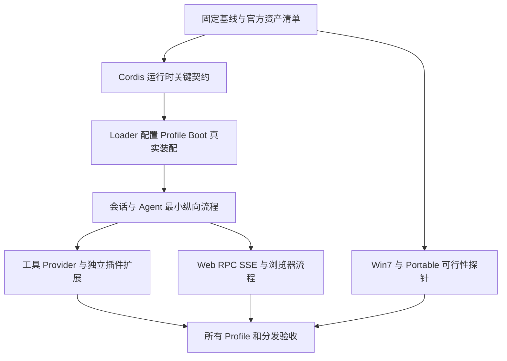

# 新基线后的持续对齐工作流评估

日期：2026-09-27。状态：供实施的设计建议，尚未部署新调度器、任务库或定时跟踪服务。本轮只更新研究文档，不改变产品接口。

后续实施进展：用户认可方案后，第一阶段记录与只读校验工具已落地到 [migration 入口](../../migration/README.md)。已发现 manifest、建立 Cordis 场景索引和初始任务；状态见 [生成看板](../../migration/status.md)。下文保留原评估时点及完整目标设计，不能把其中尚待建设的调度能力当作已实现功能。

## 1. 结论与对原 research 的修订

建议采用「契约驱动的持续对齐工作流」，先以单执行者跑通，再按依赖图开放并行。单智能体和多智能体共享任务、契约、证据和集成规则，仅执行槽位不同。现阶段优先建设可验证的迁移资产，不先绑定某个代理 SDK 或重建控制台。

[原研究](2026-09-26-migration-agent-architecture.md)关于固定上游、架构决策所有者、独立工作副本、差分验证和合并队列的方向成立，但还不足以直接调度长期迁移：

| 主题 | 保留的判断 | 需要补齐或调整 |
|---|---|---|
| 多智能体组织 | 核心设计需要唯一责任人 | 角色是职责，不必分别常驻一个代理；核心阶段单实现者更合适 |
| 任务划分 | 按行为及必要消费者交付 | 明确定义变更闭包、契约修订号和依赖类型，不能用包清单直接排队 |
| 权限与所有权 | 不以目录限制必要修复 | 默认整仓读取、隔离工作树内允许跨模块编辑；并发冲突由协调协议处理 |
| 记录 | 仓库保存事实，执行器可替换 | 明确每类事实唯一权威、状态转换和失效规则 |
| 集成 | 在合并候选验证 | 当前 `.github/workflows/release.yml` 只有 tag 发布工作流，不能视为已经具备 PR 对齐门禁 |
| 持续跟踪 | 固定上游 SHA | 区分已接受版本、正在迁移版本、最新观察版本；不能每轮漂移目标 |
| 验收 | 官方案例及差分优先 | 区分迁移覆盖、证据有效性、发布兼容性；不汇成一个 PASS 或百分比 |

旧 `.goose/parity_runner.py` 已明确 unit 不是文件系统边界，`.goose/project_store.py` 已存在 scope 扩展及依赖失效处理。[旧流程评估](../../.goose/cordis-workflow-assessment-20260919.md)还记录了重验、增量评审和仲裁机制。不能把失败原因简化成“换掉 Goose”或“加一个 reviewer”。真正需要改变的是语义修复单位和确定性的状态处理。

## 2. 以哪些事实为起点

- 本地产品基线：`449396c008ff7ac817963bc42e80b90561a0e27f`。
- `reference` 子模块固定上游：`cd5ef8148158c3a752a658978873241fdf8e2bbc`。
- [基线整合记录](2026-09-27-consolidated-baseline.md)记载独立工作树回归为 2901 passed、3 skipped、2 warnings。新 portable 包、Win7 实机及真实 API 尚未验收。
- `tests/1to1/cordis/test_cordis_core_semantics_parity.py` 已有 C1–C21 源码语义映射，不能抛弃这些资产再从包名重做迁移。
- 固定上游的 `package.json` 已包含模块图、scoped events、Cordis/client/tool/config/persistence catalog 的生成及验证入口，以及 snapshot、Web、E2E 测试入口。这些应作为图谱和基准的输入，不只抓源码目录名。本轮没有执行这些上游入口。

上游官方 README 明确处于开发预览且会发生破坏性兼容变化。因此建议按固定版本批次持续对齐，而非让所有任务追随浮动 HEAD。[官方仓库](https://github.com/deepseek-ai/deepseek-harness)

本报告不推断当前最新上游 SHA，也不宣称现有 1to1 文件名代表完整差分覆盖。后续 inventory 必须逐项核对实际执行路径。

## 3. 明确“一比一”的验收对象

目标是：在指定上游提交和声明支持的平台范围内，保留可观察行为、插件组合语义、协议、配置、持久化及用户流程；Python 内部实现可以不同，但不能以“Python 风格”改变这些契约。

必须覆盖以下维度：

1. Cordis：上下文身份与作用域、服务解析、inject、effect 所有权、Fiber 状态、事件调度、异常、取消、卸载和 HMR。
2. 产品：CLI/profile、默认值、工具参数和错误、agent loop、会话恢复、provider 协议。
3. Web：保留官方 React/TS 源码及构建来源，核对 RPC envelope、双 SSE、事件顺序、重连恢复和实际浏览器交互。
4. 分发：模块发现、资源加载、外部工具、干净机器启动及 portable 文件闭包。

差异必须有分类，不能一概叫“兼容适配”：

| 类别 | 处理 |
|---|---|
| 实现差异、外部等价 | 写明映射和证明场景，不计作功能豁免 |
| Python 3.8 / Win7 必要限制 | 逐条登记无法等价的行为、原因、替代方案、受影响功能和复查条件 |
| 本地额外兼容行为 | 如旧 CLI 入口、兼容 `set_service`；隔离到适配层，保留单独测试，防止污染上游行为 |
| 非平台原因的行为偏差 | 普通迁移缺陷，不得借适配名义关闭 |
| 尚无有效证据 | 标为 unknown 或未验证，不默认等价 |

“无需预装依赖”不等于包内没有运行库。Win7 前端还必须固定可用浏览器版本；现代浏览器通过不证明 Win7 上可用。上游仅支持其他平台的功能也要进入总清单，记录适用性与依据，不能静默消失。插件数量和 release 版本号应由目标上游清单导出，不能永久写死为当前数量。

## 4. 依赖图与优先顺序

需要三个互相关联但不同的图：

- **产品契约图**：谁提供、谁消费什么语义；来源包括源码、事件、动态服务名、配置和持久化格式。
- **执行任务 DAG**：当前批次哪些可独立执行、哪些必须等待；记录依赖的具体契约修订和完成条件。
- **验证影响图**：哪个契约/文件/fixture/工具版本变化，会使哪些证据需要重验。

静态 import 图只能提供候选关系。Cordis 动态注入、事件 hook 和跨进程 RPC 必须补充，否则图看似完整，影响分析仍会漏消费者。

建议阶段顺序如下。它是门禁方向，不是把所有模块永久串行：



**Cordis 优先意味着先稳定下游要使用的契约，绝不要求重写整套 Cordis 才能做其他工作。** 对已有测试做可信度核对和缺口补齐；每个下游任务只要求它消费的契约已在当前目标版本验收。核心期间，下游仍可做源码分析、官方测试提取、前端来源比对等不依赖未知语义的工作。

第一批核心验收至少覆盖：服务声明与可用性、调用者绑定、上下文继承与 agent scope、inject 激活/失效、异步同步前缀与延续偏序、effect 清理与等待、取消/错误传播、HMR 同路径不同注册身份。强耦合的 Context/Reflect/Fiber/EventBus 由一个实现 owner 处理；Timer/Loader 的必要接入同时进入候选。

任务边区分：

- `requires`：硬依赖，绑定契约 revision 及集成证据；不满足不可领取实现任务。
- `informs`：分析结果或参考，无需阻断执行。
- `cochange`：本次必须共同提交、验证的变化，合成一个交付闭包。
- `conflicts_with`：并发写入或决策冲突，由调度器串行，不伪造成产品依赖。

产品图可以有环。执行图出现环时，先判断是否错误地把消费者完整功能反向挂到 provider；若确实是不可分离的契约变化，就收缩为一个共同交付任务。禁止任意删边或让双方永远等对方 integrated。provider 的消费者兼容探针属于其验收闭包；消费者的新增独立功能仍是后续任务。

## 5. 跨模块修复：责任边界不能成为编辑禁区

任务范围描述的是验收责任及预计影响，不是写路径白名单。worker 在自己的隔离工作树中可以修改必要的 provider、消费者、适配层和测试；不得直接修改另一个 worker 的工作树。模块 owner 是通知和设计协调责任，不是每次编辑都需用户批准的权限门。

跨接口变更采用以下顺序：

1. 记录失败不变式、上游依据、接口 revision 及消费者清单，说明为什么只改当前模块不完整。
2. 没有其他活跃 writer：在同一任务中扩展范围，记录新增路径与验证对象，继续实施。
3. 存在活跃 writer：先保存双方进度，由协调者选择一个契约 owner；暂停冲突写入或转移必要消费者修复，保留无关工作。
4. 契约 owner 在自己的候选里完成提供端与必要消费端；原消费者任务 rebase 后继续剩余功能。若采用堆叠分支，必须显式绑定依赖提交，最终按组合候选验收。
5. 更新契约、映射、回归用例和任务关系，运行闭包测试，再进入合并队列。不能将半套接口先合入 master。

例如服务代理的调用方绑定改变，需要同步修工具服务、session 适配和调用测试。应形成一个「调用身份一致性」候选，而非“Cordis 完成，工具失败归另一个目录”。相关工具 owner 可以协助，但最终只有一个契约决策及一份组合验收证据。

软预约可以记录任务、契约、预计路径、租约期限和最近 checkpoint。预约超时只意味着待核查，不能直接把活跃工作覆盖掉。共同热点文件可以串行；同一文件不同行也可能语义冲突，不依赖 Git 自动合并来判断兼容性。

## 6. 通用记录：一个事实只有一个权威来源

建议新增下列目录；以下是待实施结构，不表示文件和工具已经存在：

```text
migration/
  baseline.json             # accepted/target/observed upstream 与产品提交
  modules.json              # 完整目标清单、来源和实现映射
  contracts/<id>.json       # 契约修订、消费者和行为要求
  tasks/<id>.json           # 每个任务的唯一持久状态
  mappings/<module>.json    # 上游案例到本地测试/差分场景
  deviations/<id>.md       # 平台限制和本地兼容扩展
  decisions/<id>.md        # 跨模块裁决和被替代决策
  evidence/<run-id>.json    # 提交/环境/命令/结果/产物摘要
  updates/<batch-id>.md    # 上游更新批次及影响核算
  status.md                # 生成视图，不手工维护第二份状态
```

小规模先用 Git 文件 + 单一协调写入者。worker 提交实现结果及状态提案，由协调者更新任务状态；worktree 中的旧状态文件不是实时锁。调度租约可放本机单一 SQLite 事务库，但只管理活跃进程/租约，不再独立决定任务是否完成。PR/CI 是证据输入，聊天和看板是视图。

若未来采用外部任务库，必须一次性迁移状态权威并让 Git 任务状态成为导出物；不要同时保留三个可写的“完成”开关。一个文件一任务可减少冲突，但不能代替领取事务和单写入者。

任务至少保存：

```json
{
  "id": "MIG-CORDIS-001",
  "goal": "待 inventory 确认的运行时契约验收示例",
  "state": "draft",
  "target_upstream": "cd5ef8148158c3a752a658978873241fdf8e2bbc",
  "base_product": "449396c008ff7ac817963bc42e80b90561a0e27f",
  "owner": null,
  "requires": [],
  "provides": [],
  "consumers": [],
  "expected_paths": [],
  "acceptance": [],
  "open_findings": [],
  "candidate_commit": null,
  "evidence_ids": [],
  "next_action": "核对上游契约与现有证据，不直接开始重写"
}
```

示例不是已可执行任务；验收、来源、契约和必要依赖填齐后才可进入 ready。记录稳定 ID、revision、事件序号和替代关系；不要用自然语言标题、聊天轮数或模型的 PASS 作为主键。

契约记录必须包括：上游 SHA/符号/案例、Python 接口映射、对象身份、生命周期所有者、状态转换、事件偏序、错误/取消规则、消费者、适配原因和反例。尤其不能只写函数签名。

每次 checkpoint 保留候选提交、未提交内容指纹、任务 revision、当前问题、已排除假设、下一条具体操作和证据引用。恢复时先校验工作树和基线，不把完整历史对话当作事实库，也不从头重复实现。

## 7. 状态机、证据与错误分流

建议生命周期为：`draft → ready → running → review → verified → queued → integrated`。

- `verified` 只证明某个固定候选通过指定门禁；`integrated` 要有实际 master 集成提交及对应证据。
- 阻塞单独保存 `blocked_reason`、`waiting_on` 和恢复条件，不把基础设施故障编码成产品缺陷。
- 已合入任务的历史 integrated 事实不撤销；契约改变时将当前证据标为 `stale`，创建关联重验/修复任务。
- `released` 属于发布批次，不让每个任务自称 Win7 已发布。
- ready 条件包括依赖满足、验收明确、必要输入可取得及无冲突租约。完成状态由校验器推进，不能只接受模型自报。

每份证据绑定：产品候选提交或树指纹、上游 SHA、契约 revisions、测试/fixture/runner 摘要、解释器及 OS/浏览器版本、命令和 cwd、退出码、失败/跳过/告警、日志路径及内容 hash。原始日志放 CI artifact 或本地归档，Git 保存摘要；长期验收不能只链接短期过期产物。

证据复用按输入依赖判断，不能仅看模型是否相同或 HEAD 是否相同。相关契约/代码/fixture/运行环境改变必须重验；纯文档变化可以复用语义证据。图谱未覆盖或高风险核心变化采取保守扩大验证。每个准备合入的代码候选仍按项目规定运行完整 pytest；不要在同一未变化候选的每个角色阶段重复跑全量。

| 失败类型 | 去向 |
|---|---|
| 字段、路径、结果格式错误 | 校验器给精确原因，修正报告，不重新语义迁移 |
| 依赖安装、端口、runner 启动失败 | 基础设施修复并保留原产品候选 |
| 可复现产品差异 | 契约 owner 修复，保留旧失败/新通过证据 |
| 上游行为存在歧义 | 最小两侧探针，再记录设计裁决 |
| 合并后交互回归 | 在组合候选重现，归到共同契约，而非随机退回某 worker |
| 疑似 flaky | 保存所有运行及复现条件；重复通过不抵消已知竞态 |

评审交接只包含本轮目标、候选差异、契约 revision、开放问题、证据引用和下一步。评审不直接修实现；需要修复时显式转回实现职责，避免边审边改导致证据对象漂移。

## 8. 单智能体与多智能体如何复用同一流程

单智能体模式：领取 ready 任务 → 源码/契约核对 → 反例和差分探针 → 修改完整闭包 → 验证 → 换评审视角检查上游与测试 → 集成。自己复查不能标为独立评审；核心高风险候选可另起干净验证会话或交人工审阅。

多智能体模式：一个协调职责维护目标和契约决策，若干 worker 实现独立闭包，一个按需验证职责检查候选，确定性服务负责命令、证据和队列。角色可以由同一人或同一执行器在不同时段承担，不强制每个任务走 planner/executor/judge 的完整链。

建议启用节奏：

| 阶段 | 同时执行的工作 | 放行条件 |
|---|---|---|
| 核心契约梳理 | 1 个实现者；分析、测试提取可独立开展 | 核心行为模型与必要消费者闭包明确 |
| 试点 | 最多 2 个实现任务，按需验证 | 同一记录协议跑通核心、独立插件、真实纵向流程 |
| 稳态迁移 | 按 ready 任务和冲突情况调整槽位 | 等待/返工没有吞掉新增有效覆盖 |
| 上游核心变动 | 临时收紧相关契约并行 | 完成新契约修订及受影响消费者重验 |

比较效率时看：每个已验收契约的总耗时/费用、跨模块返工率、排队时间、评审漏检、上游落后范围、恢复是否重复工作。不以提交数、代理数量或测试条数作为主要产出。本方案的具体并行数是试点建议，尚无项目对照实验支持。

外部并行编译器实验也提示，对照实现和可拆解失败决定并行工作的价值；不能把其代理数量直接当作本项目配置。[Anthropic 工程报告](https://www.anthropic.com/engineering/building-c-compiler)

## 9. 持续跟踪 DeepSeek 上游

维护三个指针：

- `accepted_upstream`：已经完成声明范围验收的版本；当前若尚未完整验收，必须允许为空，不能把 reference SHA 自动当 accepted。
- `target_upstream`：正在迁移的固定 SHA；本地 reference 当前固定值作为首批目标。
- `observed_upstream`：最近观察到的上游 SHA、时间和来源 ref；只用于发现新变化。

建议后续设置每日轻量检测、按影响量开启更新批次，安全/持久化关键修复单独优先处理。这是调度建议，本轮没有创建自动化。

每次更新批次：

1. 获取上游新 ref，记录 SHA；检测任务只生成候选更新记录，不改当前迁移目标或工作中的 reference。
2. 比较目标与候选的源码、测试、快照、manifest、lockfile、vendor、生成 catalog、构建规则和资源。非祖先关系显式处理，不能假设始终线性快进。
3. 分类为无运行时影响、原样同步、内部行为变化、公共契约变化、平台限制、新增/移除模块。重命名、删除测试和依赖升级同样需要核算。
4. 结合契约图传播影响，更新案例分母、记录旧证据可继承依据；无法确定影响的项进入分析任务，不能默认无影响。
5. 为选定批次固定新 target，在更新分支按核心到消费者推进；旧批次保留，不让在途任务自动换题。
6. 运行两侧差分、跨版本 session/config 恢复、前后端配套验证和发布门禁；合入后更新 reference 及产品来源清单。accepted 仅随真实验收范围推进。
7. 生成更新报告：覆盖了哪些 upstream commit、保留哪些差异、尚落后哪些变化、何时需要再验。

新上游删除行为时，也要决定本地旧入口是否继续作为兼容扩展保留；不能既沿用旧行为又宣称这就是新上游语义。上游 bug 修复需要同步更新预期，旧版本的 golden fixture 不应永久冻结错误行为。

React/TS、JSON、CSS、资源和官方测试语料尽量原样同步，并保存来源 hash 与本地补丁清单。Python backend 的语义迁移单独核算。`reference` 作为原始对照，不在其中临时修补预期；测试适配放外部 runner。

## 10. 验证与进展如何报告

证据分层：源码映射 → 官方案例迁移 → 同场景两侧运行 → 真实组合流程 → 平台与分发验证。源码字符串断言有用途，但不能冒充执行行为相同。

差分要比较值、错误类别、消息结构、事件偏序、取消和资源释放。生成 ID 采用保持引用关系的映射，不能全部抹成同一个值；不能排序事件掩盖时序差异。固定 mock LLM 协议输入及流式分片，真实 provider 网络另列；对 JS/Python 时序用屏障控制，不靠短 sleep 猜测正确性。

建议看板同时列出：

- 完整模块清单中已盘点、未盘点的数量。
- 目标版本上游官方案例：已映射、未映射；适用、平台不适用及依据。
- 有当前有效证据的通过数、失败数、blocked、skipped、stale、unknown。
- 开放契约缺口、跨模块阻塞和最长依赖链。
- 上游观察时间、目标 SHA、落后变更范围。
- Python 3.8、现代 Windows、Win7、浏览器、真实 API、portable 各自状态。

如果用比例，必须展示分母。例如“当前有效通过案例 / 已盘点的适用官方案例”，旁边列未盘点模块，不能把它叫全项目完成率。一条上游用例拆成十条 pytest 仍只算一个映射案例；源码发现但没有官方测试的要求另计契约场景，不强塞入官方用例分母。

代码集成最低门禁：变更闭包测试、必要差分、真实消费者、完整 `.venv\Scripts\python.exe -m pytest tests` 和未决问题核对。Web 改动再补上游前端构建/浏览器流程。平台发布门禁另加新建 portable 目录/zip、固定依赖来源、干净环境和 Win7 实机或 VM；未验证时允许继续源码研究，但不得标为发布完成。

## 11. 下一阶段具体执行顺序

1. **建立 inventory 和初始记录**：导入当前 SHA、现有案例映射和已知未验证边界；旧 Goose 状态仅作历史证据，不批量迁入 PASS。
2. **补最小记录校验器**：ID/引用/DAG 校验、ready 判断、状态提案、证据输入校验和 status 生成。先手动运行；不引入常驻多代理服务。
3. **做 Cordis 验收闭包试点**：优先核对本仓库已有 C1–C21 及关联 Timer/Loader/消费者证据，选确认的缺口或证据缺口实施，不假定所有核心都需重写。
4. **补真实最小流程**：profile 启动 → mock LLM → 工具 → session 落盘 → 重启恢复；随后 Web 双 SSE/RPC/重连。缺失 provider 的替身测试不能代表集成完成。
5. **补 PR 验证工作流及分发探针**：现有 tag 发布工作流不足；先让门禁可在本地复现，再接 CI。Win7/portable 可行性检查从早期开始，不到最后才发现运行环境不可达。
6. **引入第二个 worker**：只领取无冲突的 ready 闭包；演练一次范围扩展、一次中断恢复、一次契约 revision 失效。
7. **演练一次上游更新批次**：先生成影响报告，再迁移小批次；证明不会漏新模块、不会移动在途任务目标、不会复用过期 PASS，才扩展自动化。

首轮成功标准：任务能在新会话恢复；提供端与必要消费者原子集成；依赖指向明确 revision；无效协议不触发重新编码；旧证据按影响范围失效；新上游变化可以追溯到任务和验证；发布边界不被开发机测试掩盖。

## 12. 本轮验证

在当前主工作区、Python 3.8.10 下执行 `.venv\Scripts\python.exe -m pytest tests`：**2899 passed、3 failed、2 skipped、2 warnings，165.87 秒，退出码 1**。完整日志在 `.goose/research-workflow-20260927-tests.log`。

- `tests/test_portable_smoke.py::test_smoke_dist_portable_directory`：现存旧 `dist` 启动器不识别 `--profile minimal`，符合整合记录已声明的旧产物边界。
- `tests/test_reference_tool_fs_search_specs.py::test_glob_tool_execution` 和 `::test_grep_tool_execution`：返回 `Error: path is on mount 'C:', start on mount 'D:'`。测试临时目录在 C 盘，当前仓库在 D 盘；这是本轮确认的失败表现，尚未对上游进行对照定位，不能直接判为纯环境问题或豁免。
- 两条 pytest warning 为 Windows Proactor 清理异常；另有 pytest-asyncio 配置弃用提示及 mock HTTP 客户端断开日志。

因此不能将独立整合工作树的历史通过结果无条件套到当前工作区。建议把旧 portable 重建和跨盘搜索失败录为首批基线缺口；证据还须保存 cwd、临时根目录和产物来源。本轮仅修改研究文档，未修改产品、测试或删除旧产物。没有运行上游全套测试、构建新 portable 包或验证 Win7。`git diff --check` 通过。
