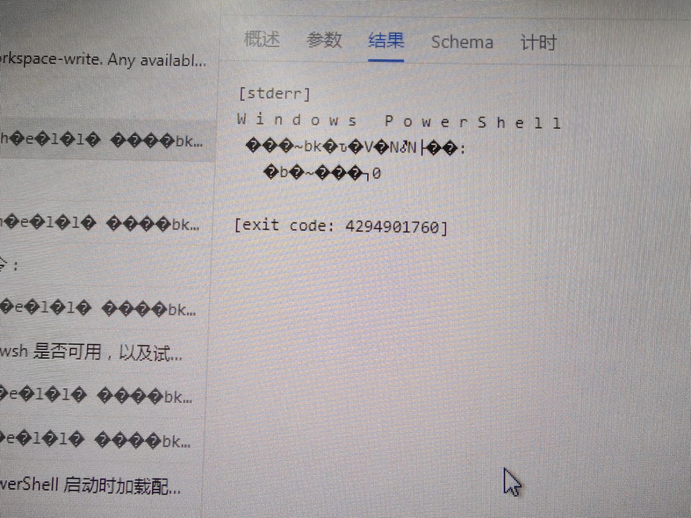

# Win7 隔离网 Portable：glob、PowerShell 与预制依赖分析报告

日期：2026-10-08。状态：**分析与交接，未实施产品修复，未形成新的发行或 Win7 真机通过结论。**

本报告汇总用户反馈、当前代码检查及本会话此前的本机诊断。交接时只读核查基线为 `D:\Project\deepseek-harness-win7`、`master`、`ec32e9194048c5dd2633a50dab64207277bab0f7`；固定上游为 `cd5ef8148158c3a752a658978873241fdf8e2bbc`。此前探索性诊断没有记录其运行时 HEAD，不把它们补绑定为此基线的验收。待办见 [HANDOFF.md](../../HANDOFF.md) 的 W7-OFFLINE-01–08；Chromium 108 的既有前端分析和门禁设计继续以 [统一兼容报告](2026-10-08-deepseek-harness-win7-unified-compatibility-report.md) 为准。

## 1. 结论与证据边界

| 问题 | 当前判断 | 证据边界 |
| --- | --- | --- |
| 源码根目录运行 glob，报 `ripgrep launch failed` | glob/grep 依赖外部 `rg.exe`；源码解析器没有覆盖当前 pnpm 固定二进制的实际位置，容易依赖宿主 PATH | 已发现并在本机诊断中复现缺少 PATH rg 时的解析失败；用户错误文案本身不能区分缺文件、不能启动或原生 DLL 故障 |
| 当前 Portable 的 ripgrep 输入 | 固定 npm 包内实际 rg 导入了 Win8 起支持的同步 API，对标准 Win7 构成原生兼容阻碍 | 检查的是当前构建输入，不是用户现场未知版本的 ZIP；没有在 Win7 运行这个二进制 |
| Win7 Portable 中任意 pwsh 命令均返回同一错误 | `4294901760 = 0xFFFF0000` 指向 PowerShell 宿主初始化失败；应先排查工具启动条件 | 用户手工在 PowerShell 2.0 运行测试命令成功；尚无现场原始 stderr、实际 argv、子进程环境及精确包身份，不能确定唯一根因 |
| PowerShell 报错乱码 | 当前一次性子进程收集器固定 UTF-8 + replacement 解码，存在丢失非 UTF-8 诊断的确定风险；截图形态与 UTF-16LE 被误解码相符 | 未获得原始字节，不能据照片证明具体编码，也不能把乱码当作导致宿主初始化失败的原因 |
| “无前置环境要求”的离线包 | 要闭合 Python、CRT、全部原生组件、搜索/终端、前端资源及内网配置；若 Web 也不得依赖预装软件，还须明确浏览器运行时交付 | 当前构建脚本有预制主体，但没有证明标准 Win7 SP1 的全部原生依赖闭合；普通开发机通过不能替代该证明 |

用户要求先分析，因此此前临时探索的 glob 路径补丁和新增测试已撤回。本次不修改工具、启动器、锁文件、原版前端或迁移台账状态。

## 2. glob 的依赖与失败链

`glob` 不是调用 Python 标准库 `glob` 的独立实现，也不靠安装一个同名 pip 包解决。它与 `grep` 共用 [search_core.py](../../dsh/fs/tool_fs_search/search_core.py) 的 ripgrep 启动链，并通过 Cordis 的 `subprocess` 服务执行。

`resolve_rg_path()` 当前按以下候选解析，并缓存已解析路径：

1. 继承启动环境的 `DSH_RG_PATH`；此分支转绝对路径后直接返回，不预先验证能否执行。
2. 解释器侧的 `sys.executable + "-rg"`。
3. 工具包的 `dsh/fs/tool_fs_search/bin/rg.exe`。
4. `reference/node_modules/@vscode/ripgrep-win32-x64/bin/rg.exe` 等平台对应的直接包路径。
5. 宿主 PATH 上的 `rg`。

本机源码树缺少工具包内二进制和第 4 项直接包路径，但存在 [构建脚本](../../scripts/build_portable.py) 使用的固定 pnpm 路径：

```text
reference/node_modules/.pnpm/@vscode+ripgrep-win32-x64@1.18.0/
  node_modules/@vscode/ripgrep-win32-x64/bin/rg.exe
```

运行时解析器与构建输入解析器不一致。本机会从 Codex 提供的 PATH 找到 rg 15.2.0；在诊断中屏蔽该 PATH 查找后，出现 `FileNotFoundError: packaged ripgrep binary is unavailable`。这解释了源码测试可能在开发环境偶然通过、离开该环境后报错的机制。更换环境变量后核查需启动新进程，避免沿用 `_rg_path_cache`。

`run_ripgrep()` 把解析或启动阶段的异常归为 `SEARCH_FAILED`，生成用户看到的 `glob could not start its search command (ripgrep launch failed)`。排查需要保留内部异常类型、实际解析路径和操作系统错误；仅凭这段统一文案不能认定唯一原因。除了缺路径，还可能有执行权限、错误架构、DLL/API 缺失或 subprocess provider 启动失败。

Portable 构建会将固定 pnpm 二进制复制到工具包 `bin/rg.exe`，因此“源码缺 pnpm 路径”和“Portable rg 能否在 Win7 启动”应分别处理。后续路径修复应覆盖源码固定输入、包内优先级、显式覆盖与无宿主 PATH 情况，不能通过要求用户安装 Node/pnpm/rg 来满足 Portable 目标。

### 2.1 当前固定 rg 的 Win7 阻碍

| 项目 | 当前检查结果 |
| --- | --- |
| npm 分发包版本 | `@vscode/ripgrep-win32-x64@1.18.0` |
| 程序自报版本 | `ripgrep 15.0.0 (rev 3a612f88b8)`；npm 版本不等于程序版本 |
| 文件 SHA-256 | `f9dde63498b3193f098355dbec97af99dc4f6b8fa0df5ed04114a03012c042cb` |
| PE 普通导入中的同步符号 | `WaitOnAddress`、`WakeByAddressAll`、`WakeByAddressSingle` |
| 其他导入 | 包含 `api-ms-win-core-synch-l1-2-0.dll`、`bcryptprimitives.dll` 等，仍需闭合检查 |

微软将 [WaitOnAddress](https://learn.microsoft.com/en-us/windows/win32/api/synchapi/nf-synchapi-waitonaddress) 和 [WakeByAddressAll](https://learn.microsoft.com/en-us/windows/win32/api/synchapi/nf-synchapi-wakebyaddressall) 的最低客户端列为 Windows 8。当前符号为普通导入，标准 Win7 加载器不能仅因文件已被复制就提供这些 API；PE subsystem 标记为 6.0 也不能证明程序支持 Win7。

需要选择或构建有明确 Win7 目标的 rg 输入，记录来源、编译工具链、版本、散列和许可证，并复核实际 glob/grep 的参数、忽略规则、隐藏文件、排序、Unicode 路径、错误和取消语义。不能无依据降级版本、抄入新版 Windows 系统 DLL，或用现代 API 补丁绕开仓库要求。用户现场包的二进制仍需取散列后才能与本节建立对应关系。

## 3. PowerShell 初始化失败与编码问题

### 3.1 用户现场观察

用户明确说明截图来自复制到隔离内网 Win7 的 Portable；不是源码启动。若干 PowerShell 2.0 兼容命令手工执行成功，但工具中任意命令都返回相同错误。截图可辨认 `[stderr]`、字符间隔异常的 `Windows PowerShell`、乱码中文和 `[exit code: 4294901760]`。



截图按原始字节保存，大小 `3709253` 字节，SHA-256 `42396d1fbcab26cfd67ae63ea2d1866b77f5e23b086c34f6e50273dd584dc26c`。它是用户提供的现场观察，不是本次重测结果。现场 ZIP 的版本/生成日期/散列、启动命令和实际插件实现尚未确认；照片不包含可恢复的原始 stderr 字节。

### 3.2 退出码与实际实现

`4294901760` 是无符号 32 位 `0xFFFF0000`，按有符号解释为 `-65536`。[PowerShell 官方宿主源码](https://github.com/PowerShell/PowerShell/blob/v6.0.0-alpha.18/src/Microsoft.PowerShell.ConsoleHost/host/msh/ConsoleHost.cs) 将该值定义为 `ExitCodeInitFailure`。这是识别故障阶段的依据；引用源码不是 Win7 PowerShell 2.0 的现场二进制证明。

结合“任意命令相同失败”和“手工同类命令可执行”，优先怀疑工具创建的 PowerShell 进程在执行命令前初始化失败。退出码的十进制表示本身不需要改为另一种数值，也不能通过改用户命令语法来解释全部现象。

当前 [插件注册表](../../dsh/boot/plugin_registry.py) 将一次性 `dsh-tool-pwsh` 映射到 canonical shell 工具，持久工具另映射到 `dsh.terminal.persistent_pwsh`。一次性 [pwsh_executor.py](../../dsh/shell/pwsh_executor.py) 使用：

```text
配置 pwshPath，或 PATH 中 powershell.exe，或 pwsh，或 powershell.exe
-NoLogo -NoProfile -NonInteractive -Command <PREAMBLE + 用户命令>
```

工具名 `pwsh` 不代表必须安装 PowerShell 7。当前 canonical 前置脚本用 `New-Object System.Text.UTF8Encoding $false` 设置编码；旧实现中的 `::new()` 写法不应被直接认作当前 canonical 根因。仍要审计整个包装脚本、`LanguageMode` 属性和保护分支在真实 PowerShell 2.0 上的行为，不能只确认用户正文兼容，也不能将缺失属性与实际受限语言模式混为一谈。

截图格式更像分别收集 stdout/stderr 的一次性工具，但未知现场包和裁剪图片不足以证明实际映射。后续以现场包内注册表、profile 和 provider 配置为准。

### 3.3 优先排查启动差异

| 对照项 | 为什么需要检查 |
| --- | --- |
| 实际程序路径、x64/x86、版本 | PATH、System32/SysWOW64、配置覆盖可能选中与手工终端不同的宿主 |
| 完整 argv、cwd、临时目录 | 工具增加非交互参数和前置脚本；cwd/TEMP 的权限或路径也影响启动 |
| 子进程环境 | 当前 [subprocess local](../../dsh/subprocess/local.py) 继承经过 [敏感变量过滤](../../dsh/subprocess/service.py) 的父环境后覆盖显式项，并非只保留几个变量；不能无证据断言丢失 SystemRoot。记录变量名与必要非敏感值，不输出密钥 |
| token、sandbox、ACL、用户配置/.NET 访问 | Windows sandbox 链通过 [CreateProcessAsUserW](../../dsh/sandbox/windows_acl.py) 和受限 token 创建子进程，与手工交互用户启动有差异；该链是否用于现场调用仍须确认 |
| stdin/stdout/stderr、控制台、PTY、创建 flags | 无控制台、重定向和持久终端是不同宿主条件；应分别测试 |
| PowerShell/.NET/系统组件 | 手工可执行降低了“系统整体损坏”的可能性，但不能排除仅在工具环境或 token 下的资源加载失败 |

官方项目的 [环境导致初始化失败案例](https://github.com/PowerShell/PowerShell/issues/3545) 和 [模拟身份下的宿主失败案例](https://github.com/PowerShell/PowerShell/issues/11997) 支持把这些差异作为调查方向；它们不证明现场使用同一版本或具有同一根因。不直接升级系统 PowerShell、修复 .NET 或关闭 sandbox 来掩盖未归因错误。

后续可在 Win7 新建的独立诊断目录，从 **cmd.exe** 执行下列无副作用基线，保存原始输出而不是先按文本读取：

```bat
"%SystemRoot%\System32\WindowsPowerShell\v1.0\powershell.exe" -NoLogo -NoProfile -NonInteractive -Command "Write-Output 'PS_START_OK'" 1>ps-stdout.bin 2>ps-stderr.bin
echo %errorlevel%
```

该基线尚未执行，且不等价于 Portable 的 token/env/stdio。先取得它，再以同一现场包逐项比较实际工具 argv、前置脚本、子进程 provider 和 sandbox 创建条件；不把反复重新运行完整 Agent 回合当作隔离变量的方法。

### 3.4 编码是第二个独立问题

当前 [collector.py](../../dsh/subprocess/collector.py) 的输出和截断路径都固定 `decode("utf-8", errors="replace")`。如果宿主错误实际是 UTF-16LE 或中文代码页输出，这会插入 NUL 或替换字符并丢失信息。截图中英文字符的间隔与 UTF-16LE 按 UTF-8 解码的表现相符，但只能列为推断；“中文乱码”不能单独区分 CP936/GBK、OEM 页或 UTF-16LE。

`[Console]::OutputEncoding` 前置脚本必须在宿主完成初始化后才能执行，因此不能控制更早产生的宿主启动错误。`$OutputEncoding` 也不是 stdout、stderr 和所有 native 命令的统一转换开关。[Windows PowerShell 编码文档](https://learn.microsoft.com/en-us/powershell/module/microsoft.powershell.core/about/about_character_encoding?view=powershell-5.1) 可作为机制参考，但 PowerShell 2.0 行为仍需目标版本验证。`-EncodedCommand` 的 UTF-16LE/Base64 是命令传输约定，不是输出编码修复，见 [powershell.exe 参数文档](https://learn.microsoft.com/en-us/powershell/module/microsoft.powershell.core/about/about_powershell_exe?view=powershell-5.1)。

后续方案应先保留 stdout/stderr 原始 `.bin`、字节数、BOM/NUL 分布和有限十六进制样本，再按输出来源验证 UTF-8、UTF-16LE 或 CP936 的严格解码。不能先产生 `�` 再试图还原中文，也不能全局换成 GBK。一次性 pipe、宿主 fatal stderr、正常 PowerShell/native 命令输出和 WinPTY 通道必须分开验证；PTY 正常 UTF-8 流仍须保证增量解码与跨块多字节字符不损坏。

## 4. 无前置软件、隔离内网 Win7 的预制内容

目标按当前构建约束应明确为 **Windows 7 SP1 x64 + Python 3.8.10 x64**；x86 不是现有发行输入自然支持的另一种运行方式。需要区分“不安装 Python/Node/rg/VC 运行库等软件”与“原始 SP1 连必要系统补丁都没有”。后一目标不能仅凭拷贝当前文件夹成立，必须闭合系统 API/加载器约束；若最终要求 serviced Win7 或离线安装 MSU，应明确为前置 OS 基线/安装流程，不能继续宣称原始 SP1 零安装。

### 4.1 打包清单与缺口

| 预制项目 | 包内必须包含或保证的内容 | 当前状态 / 后续动作 |
| --- | --- | --- |
| Python 运行时 | `python.exe`、`python38.dll`、所需 `python3.dll`、完整标准库、`DLLs/` 扩展、`python38._pth`；`ssl`/socket/ctypes 及 OpenSSL 依赖 | 构建校验实际 3.8.10 x64 并复制运行时；需在包内解释器实际启动/import，不靠已安装 Python |
| VC/UCRT | 与解释器及各 helper ABI 匹配、合法可分发的运行库和 API-set 文件，布局满足 Win7 加载器 | 当前检查的运行时根目录有 `vcruntime140.dll`/`vcruntime140_1.dll`，没有 `ucrtbase.dll` 或 `api-ms-win-crt-*`；`python38.dll` 导入 CRT API-set。构建复制已有 DLL，但没有强制证明闭合，不能认定当前输入满足原始 Win7 |
| Python 第三方依赖 | [requirements-runtime.lock](../../requirements-runtime.lock) 的全部精确分发文件、元数据、数据资源与 cp38-win_amd64 原生扩展 | 当前按锁文件复制；锁定版本或 wheel 标签不是 Win7 原生 API 资格证明。Pillow、protobuf、wrapt 等含原生部分的依赖需实际核查 |
| 搜索 | Win7 可运行的 `rg.exe`、固定来源/版本/散列/许可证 | 当前固定输入有上述 Win8 API 阻碍，P0；包内有文件不等于能启动 |
| 持久终端 | pywinpty 的 cp38 扩展、`winpty.dll`、`winpty-agent.exe`、随附 GCC/winpthread DLL 等完整文件 | 当前锁定 `pywinpty==0.5.7`；旧 PE/API 检查没有发现同类现代 API 依赖，但必须复核 helper 子进程和真实终端行为 |
| PowerShell/cmd | 显式且稳定的系统 shell 解析、PS2 包装脚本、编码/stdio/权限行为；若承诺 cmd fallback，需实现并验证 | 当前一次性工具没有显式 cmd fallback。PowerShell/.NET 是 OS 组件，不能只复制 `powershell.exe` 来闭合；不把 PowerShell 7 作为 Win7 必装项 |
| Session 原生组件 | SQLite DLL/manifest；ICU 的 uc/in/data DLL；zstd DLL/字典；Unicode CaseFolding；SQL 资源及许可证/构建来源 | 当前 dsh 树和检查覆盖多项资源；SQLite 3.51.2、ICU 78.2 等实际产物仍需目标系统加载/读写资格，版本号和 subsystem 标记不替代它 |
| 内置 JS 工作流 | [dsh_js_worker.exe](../../dsh/javascript/bin/dsh_js_worker.exe)、runtime manifest、工作流资源、许可证及其原生依赖 | 预构建 QuickJS helper 随 dsh 复制，基础运行不应要求用户安装 Node；外部 JS/MCP 扩展另核查 |
| 框架与 profile | dsh、apps/cli、canonical profile/boot、packages 运行资源、`dsh.py` 与绝对包内 Python 的 `.bat` 启动器 | 当前构建具有主体，不恢复 legacy `--mode`/旧 Web 桥；测试可写目录与启动 cwd |
| Web 静态资源 | 固定原版 `apps/web/dist`、client packages、动态 bundle、CSS/font 等；兼容层经 Host 注入 | 当前复制主体；资源完整与目标浏览器可执行分别验证，沿用 C108-01–04 |
| Web 浏览器 | 若零前置也覆盖 Web，需预制可运行的 Win7 浏览器、所需 DLL、隔离 profile 与明确启动路径/许可材料 | 当前 Web 使用系统默认浏览器，没有随包提供产品浏览器；已有 108 自动化 observer 是验收工具，不能算产品运行时 |
| 离线配置与信任 | 内网 API 配置模板、可信 CA、代理/直连规则、离线 profile、只读产品资源与可写数据目录策略 | 必须经实际 canonical Provider 验证；不得要求现场 pip/npm 联网补装 |

Python 3.8 文档指出 Win7 需要 KB2533623 或等效更新，embeddable 包不能像安装器一样检测缺少的更新，见 [Python 3.8 Windows 说明](https://docs.python.org/pl/3.8/using/windows.html)。[微软 UCRT 部署说明](https://learn.microsoft.com/en-us/cpp/windows/universal-crt-deployment?view=msvc-170) 允许特定 app-local 部署，但要求完整文件集和正确布局，Win8 以前还特别约束主 executable 目录。helper executable 的运行库也要沿其真实加载路径检查；将离线安装包塞进 ZIP 并不等于无需安装/权限/重启。

当前构建的“把 runtime 根目录中的已有 DLL 全部复制”可能复制未来补齐的输入，所以缺口应描述为 **没有强制校验目标 OS 的依赖闭合，且此次检查的输入缺少 UCRT 集合**，不是断言脚本永远不会复制 UCRT。不得通过复制目标 OS 不支持的新系统 DLL 或禁用证书验证获得表面通过。

### 4.2 内网 LLM 和外部功能边界

内网 API 服务承担推理，Portable 基础客户端不需要本地模型权重或 GPU。包内要预制配置入口和可验证的协议适配，现场提供实际地址、认证信息和服务能力。

- 核查实际 canonical LLM Provider 的 `baseURL`、模型 ID、上下文/输出限制，以及 tool calling、streaming、取消与 reasoning 扩展。不能只因“OpenAI-compatible”就认定 DeepSeek 专有能力、搜索或文件接口均存在，也不能沿用已退役启动链的环境变量行为。
- [environment.py](../../dsh/cordis/environment.py) 将 `DEEPSEEK_BASE_URL`、`SSL_CERT_FILE`、`REQUESTS_CA_BUNDLE`、proxy 等列为 bootstrap-only，发现的项目/用户 `.env` 不能随意注入这些值。内网地址、CA、proxy 应从可信启动环境或相应 canonical 配置/`--patch` 入口提供，不能写一份无法生效的通用 `.env` 说明。
- HTTPS 需要内网 CA、正确主机名和系统时间。当前 HTTP 路径同时涉及 urllib/OpenSSL 与 requests，应分别验证实际调用所用的信任入口和 proxy/NO_PROXY；certifi 默认集合不代表已经信任内网 CA。
- 隔离网 profile 明确关闭外部 telemetry/OTLP、在线搜索、更新和联网插件下载等不适用能力；当前 telemetry 默认禁用，不把它描述为已证实的外联故障。完整 Web 资源不得依赖现场访问外部 CDN。
- Git、编译器、项目 SDK、任意 npm/Python 项目依赖和外部 MCP server 不是基础 Harness 自动包含的能力。若承诺相应工具或插件在隔离网可用，其可执行文件、传递依赖及配置也必须单独预制；不能把基础包可启动扩展成任意工程可离线构建的承诺。

OS 基线、可读写的 workspace/TEMP/用户数据目录、系统 PowerShell/.NET、本地 Web 端口和可达的内网服务仍需列明。前置“软件免安装”可以由包内产物实现，OS 能力与网络可达性不能由包名保证。

## 5. 后续诊断顺序与验收要求

1. 补现场身份：原始 ZIP/文件清单、`build-provenance.json`、SHA-256、启动命令/profile、Win7 SP1/架构/补丁基线、PowerShell/.NET 版本。查明一次性或持久终端映射，不猜测截图对应当前源码。
2. 保存可复核原始观察：无副作用命令、完整 argv/cwd、实际 rg/shell/helper 路径、token/stdio/console 条件和原始 stdout/stderr。先恢复可读诊断，再定位 PowerShell 初始化失败；保存初次失败，不用后续成功覆盖。
3. 完成最小目标组件实验：source 无 PATH 的搜索、Win7 rg 启动/实际 glob/grep、包内 Python/import、一次性 shell 和持久 PTY。针对实际原因设计补丁和消费者回归，保持 sandbox、取消、超时、资源清理与 Cordis ownership。
4. 冻结离线发行输入：明确原始 SP1或已 servicing OS 基线、可分发 CRT/native 组件、完整锁文件、浏览器运行时决策、内网 Provider/CA 配置、外部功能范围。记录所有原生 helper 的 PE/API 和实际运行证据。
5. 稳定候选后按 [testing.md](../testing.md) 通过 `verify_release.py` 统一执行发行资格，不在其前面重复全量 pytest。最终 ZIP 新目录实际解压，移除对宿主 Python/Node/rg/PATH 的依赖，隔离外网并使用约定的内网 API，覆盖 CLI/Web、搜索、编辑、shell/PTY、中文路径、Session、工作流与 C108 浏览器旅程。

实际回执绑定同一 commit、冻结输入、OS/浏览器身份和精确 ZIP 散列；静态 PE 审计、本机定向测试、108 observer 和 Win7 真机各自记账。既有 Win7 正式认证按用户决策继续延期，本报告安排待办和材料准备，不自动恢复该门禁，也不将用户现场照片认作正式资格。

## 6. 本会话已有诊断记录及本次文档验证

此前本机记录保留在忽略输出目录，供维护者参考，未作为正式迁移证据归档：

| 记录 | 已有结果 | 可使用范围 |
| --- | --- | --- |
| `.goose/out/glob-diagnostic-20261008-165105/` | 34 passed / 1 skipped，退出 0；fs_search 及其参考规格、scope/parity 定向测试 | 本机当时 PATH 有 rg；不能证明无 PATH、当前 commit 或 Win7 可用 |
| `.goose/out/glob-fixed-20261008-165254/` | 40 passed / 1 skipped，退出 0；含探索性路径补丁与屏蔽宿主 rg 查找的验证 | 补丁和新增测试已撤回；不是交付结果、当前代码资格或 Win7 验收，不与上一行累计 |

本次交付只新增报告、原始截图副本及 HANDOFF 待办。验证范围是文档 diff/新增链接目标、待办对应关系和截图散列；该范围适合文档变更。没有因写报告重跑 pytest、重建 Portable、执行完整发行门禁或进行 Win7 真机重测。
